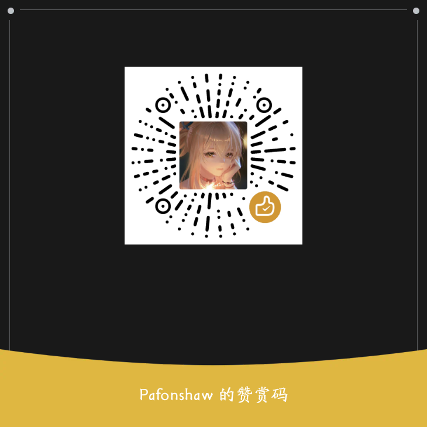

# 注意: 
# 该项目仅用于学习研究, 请遵守豆包AI的使用条款和政策。  
# 该脚本仅用于学习交流, 请遵守法律, 禁止用于违法活动.  
# 使用该脚本造成的一切后果与本人无关, 此脚本仅做技术分享  

# Doubao-AI  

__逆向自 [豆包AI](https://www.doubao.com/) 接口__  
__图片上传 AWS Signature V4 - Volcano Version 算法逆向__  
__需要cookie 和 AI接口url查询参数__  
__仅供学习, 本脚本面向开发人员, 专于分析图片上传算法, 未对AI接口做任何处理, 不可直接使用__  

[doubao.py](./doubao.py) 是算法脚本, 如果你只对算法感兴趣, 查看该文件即可  
[14905.f2983cd5.js](./14905.f2983cd5.js) 是关键js文件留档, 算法主要集中在这里面, 如果你想自己分析, 可以查看该文件  

## 注意事项  
- 该脚本仅用于学习和研究, 请遵守豆包AI的使用条款和政策  
- 该脚本仅用于学习交流, 请遵守法律, 禁止用于违法活动.  
- 使用该脚本造成的一切后果与本人无关, 此脚本仅做技术分享   

## 作者  
- @Pafonshaw
- QQ: 271607916

## 开源协议  
- MIT License  

## 日期  
- 2025/08/03  

## 请作者喝杯奶茶  
  

